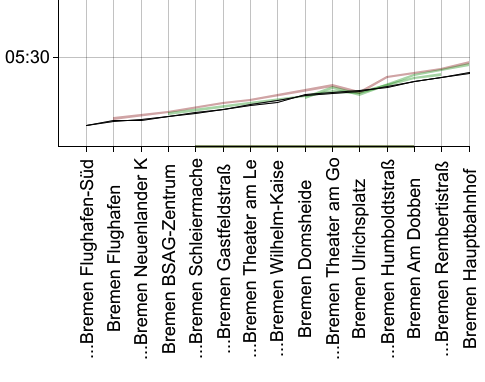
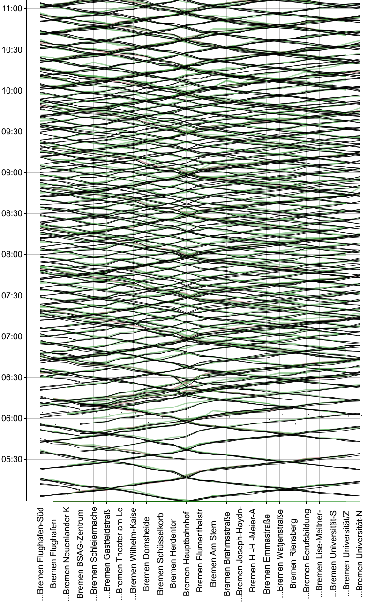
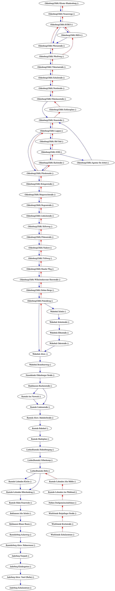

Unser erster Post [Echtzeit-Daten - Probleme und Lösungen](/opendata/2020/03/13/datensammlung.html) ist nun vor mehr als einem Monat erschienen und endete mit den Worten:

> Noch haben wir keine Pipeline fertig, die die Echtzeitdaten parst, in eine Datenbank schreibt, mit den Fahrplandaten zusammen führt, statistische Auswertungen generiert… sondern einfach nur ein Shellscript, das die Daten herunterlädt und zippt, damit unsere Micro-SD-Karte im Raspberry Pi nicht so schnell voll ist. 
>
> Seit dem Abend des 12.03.2020 sammeln wir damit jene Echtzeitdaten im 2-Minuten-Takt, und wenn das nachfolgende Badge nichts gegenteiliges sagt, dann sammeln wir noch heute…
> 
> 

Was ist seitdem passiert?

<!--more-->

## Veränderungen bei der Datensammlung

Nun, wir haben durchgängig weiter alle zwei Minuten Daten gesammelt, und haben dabei insgesamt etwa 12 Minuten Downtime gehabt, die praktisch komplett auf kurzfristige Ausfälle bei den Datenanbietern zurück gehen. Unsere Prozesse haben sich in der Zeit gewandelt, und ein großer Teil des letzten Monats ist in eben diese Umstellungen geflossen.

Außerdem haben wir damit begonnen, die gesammelten Daten zu analysieren. Dazu weiter unten mehr…

### Docker
Klar, man _muss_ nicht alles mit Docker machen, nur weil es geht. Aber es ist schon echt praktisch, vorallem wenn eh schon Docker-Kenntnisse im Team vorhanden sind. Dass wir in [dystonse-docker](https://github.com/dystonse/dystonse-docker) einen Stack aus `mysql`, `phpmyadmin`, unserem (namenlosen) Datensammelskript und `dystonse-gtfs-data` haben, die wir mal eben auf jedem unserer Rechner hochfahren können, hat uns viel Ärger gespart und den Reibungslosen Umzug auf die "neue" Hardware ziemlich trivial gemacht.

### Hardware
Unser Raspberry Pi 3 Model B+ würde früher oder später an seine Grenzen stoßen. Wir haben daher einen alten MacMini aus dem Jahr 2010 heraus geputzt, der sich derzeit recht gut als Datensammler und Datenbank-Server schlägt. 8 GB Ram und eine "richtige" Festplatte sind natürlich nicht die Traumausstattung für eine Datenbank. Aber da wir darauf nativ Linux booten, laufen Docker-Container darauf um ein vielfaches (!) Performanter als auf einem MacBook Pro von 2018 unter MacOS. Vom Raspberry Pi ganz zu schweigen…

Wobei wir mit dem eh nicht nur Performance- und Kapazitätsprobleme hatten. Docker läuft darauf zwar ganz ordentlich, aber die Toolchain um multiarch-Dockerimages zu bauen (also solche, die z.B. sowohl auf `amd64`- als auch `armv7`-Archtitektur laufen) ist noch immer etwas unhandlich und leider auch fehlerhaft. Beim Versuch, das zu beheben, sind wir [erstaunlich tief in sämtliche Abstraktionsschrichten](https://github.com/dystonse/dystonse-gtfs-data#known-problems-with-cross-compiling) des ganzen Stacks abgetaucht, letztlich aber ohne Lösung. Das ist sehr schade, eine kleine Farm aus Pis hätte eigentlich ganz gut in unserem Home Office ausgehehen.

### Datenbank
Bisher haben wir sowohl Echtzeitdaten als auch Fahrpläne nur als `zip`-Datei archiviert.

Bei den Fahrplänen waren wir uns nicht sicher, ob wir die überhaupt in einer Relationalen Datenbank brauchen. Es gibt dazu das Tool [gtfsdb](https://github.com/OpenTransitTools/gtfsdb), das wir zwar leicht zum Laufen bekamen, aber das für den Praxiseinsatz einfach zu langsam war. [Mehrere Stunden warten, um _einen_ Fahrplan zu importieren?](https://twitter.com/dystonse/status/1240757487923539972) Nein Danke.

Zwischenzeitlich haben wir überlegt, die Fahrpläne, die wir täglich herunter laden, zu entpacken und die einzelnen `csv`-Dateien per `git` zu versionieren. Auch da zeigte sich: Die Datenmengen, und vorallem auch die Menge der Änderungen, die da von Tag zu Tag auftreten, sind zu groß für `git`.

**TODO:** Kikis Ansatz aus  `Nextcloud/Prototypefund/Dystonse/Lose Notizen zur Datenarchivierung.md` erwähnen.

Es bleibt also dabei, dass die Fahrpläne nur als `zip`-Datei herum liegen. Für die Echtzeitdaten wäre das keine Lösung, denn hier brauchen wir dringend Analysen, die sich über große Teile unserer gesammelten Daten erstrecken, und dazu braucht es _mindestens_ eine relationale Datenbank. Vielleicht stellen wir auch bald fest, dass wir NoSQL / Data Warehouse / Big Data / Blockchain brauchen. Letzteres war ein Scherz, und für den Moment versuchen wir es mit einer sehr simplen [ein-Tabellen-Lösung in MySQL](https://github.com/dystonse/dystonse-docker/blob/master/db/dystonse.sql).

### Importer
Um die Echtzeitdaten in unsere Datenbank zu bekommen, haben wir ein eigenes Tool geschrieben. Sicher hätte es auch hier fertige Lösungen gegeben, aber die Gründe für eine eigene Implementierung haben überwogen:

 * wir brauchen nur einen ganz bestimten Anteil der GTFS-rt-Daten
 * wir wollen mittelfristig auch Daten aus anderen Formaten in das selbe Schema speichern können
 * eigene Anforderungen an die Verknüpfung mit Fahrplandaten (die selbst nicht in der Datenbank liegen)
 * ein paar Überpfügungen sollen schon beim Import geschehen
 * wir brauchen eine mittel-komplexe Aufgabe, um unsere neuen Theoriekenntnisse in der Sprache [Rust](https://www.rust-lang.org/) auch praktisch zu üben

Rust ist eine eigenwillige, aber ansonsten ganz wunderbare Sprache, und nachdem wir nun unseren Importer darin geschrieben haben, verfestigt sich die Überzeugung, dass es richtig ist, das Kernstück von _dysonse_ (nämlich unsere Routenuche) darin neu zu schreiben. Als erstes Projekt in Rust erstmal _"etwas kleines"_ wie den Importer zu schreiben war in jedem Fall gut - gleich mit der Suche zu beginnen hätte furchtbaren Chaoscode ins Herzstück unserer Anwendung gepflanzt. Stattdessen haben wir nun etwas Chaos an einem Ort, wo es verkraftbar ist.

Was ursprünglich `dystonse-gtfs-importer` war, ist in seiner Komplexität nach und nach gestiegen und fungiert nun als [`dystonse-gtfs-data`](https://github.com/dystonse/dystonse-gtfs-data) als Multifunktionswerkzeug. Und dank fertiger _Crates_ (so heißen die Pakete in Rust) wie [gtfs-structures](https://github.com/rust-transit/gtfs-structure) und [gtfs-rt](https://github.com/barzamin/gtfs-rt) können wir uns hier auf unsere Anwendungslogik konzentrieren, während das Parsen der beiden Eingabeformate im Wesentlichen fertig und dennoch [anpassbar](https://github.com/dystonse/gtfs-structure) ist.

### Quellen
Durch einen [Hinweis der MITFAHR|DE|ZENTRALE](https://twitter.com/mfdz_de/status/1235612004007784453) sind wir zusätzlich zu den Daten des VBN (Verkehrsverbund Bremen/Niedersachsen) auch auf ebenso offene Daten des VRN (Verkehrsverbund Rhein Neckar) gestoßen. Und dank der Kapselung mit `docker-compose` sind es für uns tatsächlich nur wenige Minuten Aufwand, eine weitere Quelle in unsere kontinuierliche Sammlung mit aufzunehmen. Wegen der geringen Datenmenge haben wir allerdings dennoch erst am 31.3. damit begonnen.

## Analyse der Daten
Eigentlich geht es darum, aus den gesammelten Daten Verspätungsmodelle abzuleiten, und damit genauere Prognosen für die nahe Zukunft zu generieren, als die die Verkehrsbetriebe bisher bieten können. An dieses große Ziel tasten wir uns derzeit langsam heran.

In einem ersten Schritt wollten wir wissen: wie viele Daten haben wir eigentlich, und wie sind diese über die Zeit verteilt? Gleichzeitig stellt sich auch die Frage: wie sollen unsere Analysen generell ablaufen, d.h. wie spielen Datenbank, eigene Tools, vorhandene Standardsoftware und die Fahrpläne außerhaln der Datenbank zusammen?

### Quantitaive Betrachtung
Unsere Datenbank hat kürzlich die 50 Millionen Einträge geknackt, und ist nun über 9GB groß - also großer als der Arbeitsspeicher unseres DB-Servers. Einfache, unschuldig wirkende Queries brauchen da ohne passenden Index mindestens 30 Minuten und [ebenso einfache trotz scheinbar passender Indices](https://twitter.com/dystonse/status/1250863486894211079) auch mal mehr als 24 Stunden. Ab und bewirken Indices dann doch noch Wunder, wenn plötzlich doch nach [220 Millisekunden](https://twitter.com/dystonse/status/1247249325559816193) Ergebnisse vorliegen. Brauchen wir denn wirklich _noch mehr_ Daten, die alles _noch langsamer_ machen?


Was man hier sehen kann:

 * Die Daten des VRN machen nur einen Bruchteil der Gesamtdatenmenge aus
 * In den Nachtstunden gehen die Daten praktisch auf Null zurück
 * Vom 20.3. bis 24.3. haben wir einfach mal gar keine Datenpunkte aufgezeichnet. Nachforschungen ergaben: Auch da haben wir alle zwei Minuten einen validen Datensatz vom VBN erhalten, der aber einfach keine stop_updates enthielt.
 * Die Menge der Daten des VBN schwankt von Tag zu Tag enorm. Betrachtet man das Tagesmittel (die dunkelgraue Kurve ist ein rollender Mittelwert über 24 Stunden) lässt sich nur sehr schwach erahnen, dass an Wochenenden und Feiertagen (deren Daten rot hervor gehoben sind) weniger Verkehr als an anderen Tagen stattfindet.

### Qualitative Betrachtung
Die heruntergeladenen Echtzeitdaten haben defintiv ihre Mängel. Unter Importer schreibt je Fehler eine Zeile in die Logdatei, und davon entstehen alle 2 Minuten gleich tausende. Die Häufigsten Fehler sind falsch aufgebaute Protobuf-Dateien, sowie `trip_id`s, die in den Echtzeitdaten auftreten aber keine Entsprechung in den Fahrplänen haben. Je Importversuch erhalten wir eine kleine Statistik wie die folgende:

```
import-vbn_1   | Done!
import-vbn_1   | Finished processing files.
import-vbn_1   | Schedule files   : 1 of 1 successful.
import-vbn_1   | Realtime files   : 1 of 1 successful.
import-vbn_1   | Trip updates     : 559 of 1801 successful.
import-vbn_1   | Stop time updates: 2305 of 2305 successful.
import-vbn_1   | Finished one iteration. Sleeping until next directory scan.
```

Aber uns fehlt derzeit noch die Gesamtauswertung darüber. Ganz grob schätzen wir, dass 50% der erhaltenen Echtzeitdaten gar nicht erst in die Datenbank kommen, da sie zu unlesbar oder unvollständig sind, um sie sinnvoll weiter zu verarbeiten.

Was in der Datenbank landet, wirkt auf den ersten Blick überwiegend plausibel. Aber ehrlich gesagt: in den rohen Daten kann man eigentlich eh fast gar nichts sehen.

**TODO:** Ich würde gerne dieses Filmzitat einbauen, aber es einfach nur da drunter zu packen scheint mir etwas zu platt

> Neo: "Ist das..." [deutet auf die mittleren drei Bildschirme]
> Cypher: "Die Matrix? Ja..."
> Neo: "Und du siehst sie dir nur codiert an?"
> Cypher: "Man gewöhnt sich dran. Ich seh den Code gar nicht mehr, ich seh nur noch Blonde, Brünette, Rothaarige..."

**TODO:** Vielleicht so? Irgendwie als Bild?

> Lena: "Ist das..." [deutet auf die mittleren drei Bildschirme]
> Kirstin: "Die Datenbank? Ja..."
> Lena: "Und du siehst sie dir nur codiert an?"
> Kirstin: "Man gewöhnt sich dran. Ich seh den Code gar nicht mehr, ich seh nur noch Busse, Bahnen..."

Es braucht also mehr, um einen Überblick über die Daten und ihre Qualität zu bekommen. Was liegt da näher, als eine grafische Darstellung? Für getaktete Verkehrsmitel haben sich hier [Bildfahrpläne](https://de.wikipedia.org/wiki/Bildfahrplan) bewährt, eine Spezialform des Weg-Zeit-Diagramms. Im Ergebnis zeigt sich dann anschaulich, wie gut die Qualität der Daten ist.

Auch schon auf dem Weg dorthin wird die Datenqualität sichtbar - jedoch nicht die inhaltliche, sondern die Strukturelle. Wie viel Aufwand muss man noch treiben, wie viel Programmlogik bemühen, um aus den gesammelten Datenmengen die besagten Bildfahrpläne abzuleiten? Das Auswertungswerkzeug zu programmieren war also nicht nur eine weitere Fingerübung in Rust, sondern auch ein guter Einstieg in den Umgang mit unseren Daten und ihrer Struktur.

**TODO:** Auf diesen Artikel verweisen: https://toddwschneider.com/posts/nyc-subway-data-analysis/

Hier erstmal ein Ergebnis:



Zu sehen ist Straßenbahn-Linie 6 aus Bremen. Am unteren Rand sind Haltepunkte angegeben - nicht etwa alle Haltepunkte der Linie, sondern nur jene einer bestimmten, kurzen Linienvariante zwischen Flughafen Süd und Hauptbahnhof. Diese Variante ist schön übersichtlich, da es davon nur eine einzige Fahr gibt (nämlich die um kurz nach fünf Uhr morgens).

Im Diagram eingetragen sind die Sollzeiten laut Fahrplan (schwarz) sowie die Ist-Zeiten (farbig) der Fahrten, und zwar für alle bisher aufgezeichneten Tage. Grün sind dabei die Fahrten, die an Werktagen aufgezeichnet wurden, und rot die an Sonntagen. (Theoretisch gibt es auch gelbe Linien für Samstagsfahrten, aber die bekommen wir nur selten zu sehen - warum auch immer.)

Auf der selben Linie 6 gibt es noch weitere Linienvarianten, die andere bzw. mehr Haltepunkte anfahren. Wir kombinieren davon so viele wie möglich in einer gemeinsamen Grafik. In der nachfolgenden sind z.B. sieben Varianten vereint, die in verschiedenen Fahrtrichtungen zwischen Flughafen Süd und Univerität Nord verkehren. Einige befahren nur Teilstrecken davon, d.h. ihre Linien erstrecken sich nicht von ganz links nach ganz rechts im Diagram (zu sehen vor allem zwischen 5:00 Uhr und 6:30 Uhr).



Was war alles nötig, um zu dieser Darstellung zu gelangen?

 * Abfragen, für welche Linien (`"route"`) uns überhaupt Echtzeitdaten vorliegen
 * Die einzelnen Fahrten (`"trip"`) betrachten und zu Linienvarianten mit gleicher Abfolge der Halte (`"route-variant"`) zusammenfassen
 * Finden von Linienvarianten, die sich gut in einem gemeinsamen Diagramm darstellen lassen
 * Abfrage der Echzeitdaten für die jeweiligen Fahrten
 * Aussortieren offensichtlich falscher Datenpunkte (noch nicht ganz fertig)
 * Darstellung in einer Grafik (wir verwenden `plotters`, sind damit aber nicht so ganz zufrieden. Bessere Vorschläge?)

Als Liste betrachtet sieht das alles naheliegend und einfach aus. Zwischendurch haben wir aber auch Um- und Irrwege gemacht, so z.B. der Versuch, als allen Linienvarianten eine Art "Master-Abfolge" zu finden, in der jede Variante gut darstellbar ist. Aber gleich unsere erste, quasi zufällig bestimmte Testline - [der Bus 340 in Oldenburg](https://web.archive.org/web/20200419225955/https://www.weser-ems-bus.de/weseremsbus/view/mdb/kursbuch/mdb_302664_6340_allg_20191215.pdf) - lieferte ein Beispiel für eine Linie, die sich eben nicht linear darstellen lässt. Stattdessen ergibt sich dieses Diagram mit Verzweigungen und sogar Kreisen:



Erinnerungen an den [Busverkehr in Wernigerode](https://web.archive.org/web/20200419230244/http://pdf.hvb-harz.de/downloads/stadt_wr/wr_tag.pdf) wurden wach, und damit die Erkenntniss: Manche Buslinien lassen sich nicht in ein einzelnes Diagram stopfen.

## Qualität unserer Daten
Die oben genannte Vermutung hat sich bestätigt - nämlich dass die Daten, die es überhaupt in unsere Datenbank geschaft haben, im Wesentlichen von guter Qualität sind.

Die Echtzeitdaten haben grob die gleiche Form wie die aus dem Fahrplan, gleichzeitig gibt es prakrisch keine Daten, die ganz unrealistisch 100% Pünktlichkeit anzeigen.

Auf mnachen Linien sind die Daten eher dünn und Lückenhaft.

Und an einigen Orten - also kurzen Abschnitten bestimmter Linien - treten sehr oft unplausible Datenpunkte auf, etwa dass ein Bus die ganze Zeit 8-12 Minuten verspätet fährt, dann für zwei Halte fast pünktlich ist, und danach wieder mit 8-12 Minuten Verspätung weiter fährt. Interssanter Weise ist die Verspätung dort weder `0` noch `null`. Diese Datenpunkte heraus zu filtern wird noch etwas Arbeit bereiten.

**TODO:** Kleine Ausschnitte von Fahrplänen finden, wo die genannten Phänomene auftreten

Die grafische Darstellung erlaubt aber auch nochmal einen anderen Blickwinkel auf die Quantität unserer Daten. Auf einmal scheinen 50 Millionen Datensätze gar nicht mehr _so_ viel, und auf gar keinen Fall _zu_ viel. Für kaum eine Linie ergibt sich ein dichtes Bündel aus sich überlagernden Linien, und bei den meisten ist jede einzelne Fahrt mit bloßem Auge gut ersichtlich. Von statistischer Signifikanz sind wir da noch weit entfernt.

Können wir einfach abwarten, bis genug Daten angekommen sind? Oder müssen wir mal näher ergründen, warum wir für manche Linien nur eine Handvoll aufgezeichneter Fahrten haben, wenn doch die technische Ausstattung offensichtlich vorhanden ist? Oder doch noch weitere Datenquellen anzapfen, bei denen dichtere Daten geliefert werden? Wir werden sehen…